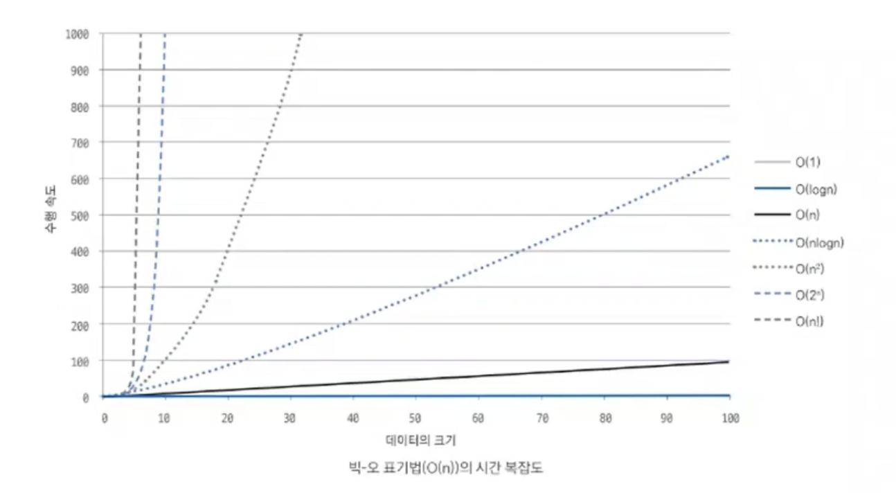

# 시간복잡도

## 시간복잡도란

시간복잡도는 문제를 해결하기 위한 연산 횟수를 의미힌다.

수행 시간은 1억번의 연산을 1초의 시간으로 간주하여 예측한다.

## 시간복잡도 유형

- 빅-오메가 Ω(n): 최선일 때의 연산 횟수
- 빅-세타 θ(n): 보통일 때의 연산 횟수
- **빅-오 O(n): 최악일 때의 연산 횟수**

## 코딩테스트에서는 어떤 시간복잡도 유형을 사용해야 할까?

코딩테스트에서는 빅-오 표기법을 기준으로 수행시간을 계산한다.

다양한 테스트 케이스를 수행해 모든 케이스를 통과해야만 합격으로 판단하기 때문에 시간 복잡도를 판단할 때는 항상 최악일 때를 염두해 두어야 한다.

## 시간복잡도 활용하기

1. 데이터의 개수 확인
2. 연산 횟수 계산 = 알고리즘 시간복잡도 X 데이터의 크기
3. 알고리즘 적합성 평가

## 시간복잡도를 바탕으로 코드 로직 개선하기

1. 상수는 시간복잡도 계산에서 제외한다.

   *O(n) == O(3n)*

2. 가장 많이 중첩된 반복문의 수행 횟수가 시간복잡도의 기준이 된다.

   *이중반복문 == O(N^2)*

코드의 시간복잡도를 도출할 수 있다면, 실제 코딩테스트에서 시간초과가 발생했을 때 문제가 되는 부분을 찾을 수 있고 효율적인 구조로 수정하는 작업으로 문제를 해결할 수 있다.

시간복잡도에서 중요한 것은,

1. 알맞은 알고리즘 선택하기
2. 비효율적인 로직을 찾아 효율적으로 바꾸기